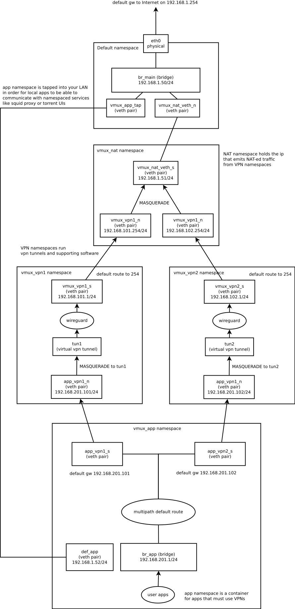

Example scripts for openvpn client loadbalancing
================================================

This repo contains an example of multi-vpn flow loadbalancing configuration that may 
or may not solve your performance and availability problems. It is a very simple round-robin
flow scheduling algorithm, that will try to reschedule TCP/UDP connections that fail to be
established.

## Prerequisites:
* reasonably modern Linux kernel.
* scripts are written for openvpn tun case, your vpn provider may not fit.
* 2 additional IPv4 addresses on your LAN.
* 192.168.201.0/24 subnet is hardcoded into the script, change it if you already have it.
* your default network namespace must have a bridge interface, tapped to your LAN. This means that if you were
connected to LAN via eth0, you need to create br_main bridge and assign your main LAN ip to it instead of eth0.

## Howto:
1. Prepare the br_main bridge in your default namespace, as described above. Example systemd-networkd configuration for an IP on your LAN bridge:
```
~ cd /etc/systemd/network/

~ ls -a
./  ../  10-brmain.netdev  15-brmain.network  20-wired.network

~ cat 10-brmain.netdev 
[NetDev]
Name=br_main
Kind=bridge

~ cat 15-brmain.network 
[Match]
Name=br_main

[Network]
DNS=8.8.8.8
DNS=8.8.4.4
Address=192.168.1.50/24
Gateway=192.168.1.254
LinkLocalAddressing=no
IPv6AcceptRA=no

~ cat 20-wired.network 
[Match]
Name=enp34s0

[Network]
Bridge=br_main
LinkLocalAddressing=no
IPv6AcceptRA=no
```
2. Edit settings at the top of create_ns.sh script to fit your network configuration and desired number of VPN client instances.
NS_COUNT, LAN_SUBNET, LAN_DEFAULT_GW, NAT_EGRESS_IP, APP_LAN_IP probably need to be changed.
3. run create_ns.sh as root. Verify that namespaces were created using
```
ip netns
```
4. In each of vmux_vpn1/2/3... namespaces run your openvpn client. This repo contains an example of systemd unit (muxvpn1.service) that runs openvpn client in the namespace.
5. Check connectivity by entering vmux_app namespace:
```
ip netns exec vmux_app curl google.com
ip netns exec vmux_app ping 8.8.8.8
```
6. Run your apps (browser, torrents, whatever) in vmux_app namespace using ip netns exec command.

## Interface and namespace shema:
